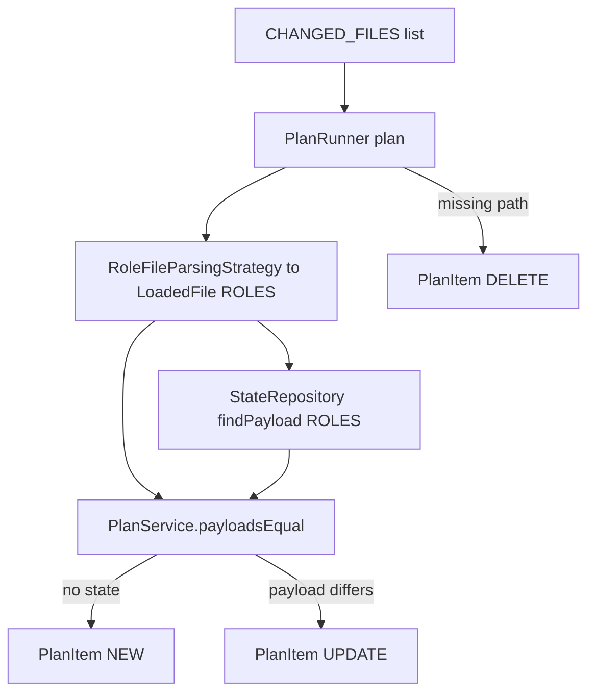
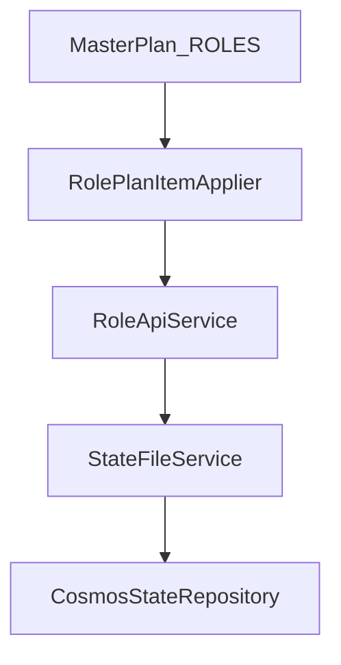

# Roles Plan + Apply

Roles bundle policies for specific user groups. They are planned after policies so references are available.

## Plan flow

- Directory: `changedfiles/<...>/roles/` (configurable).  
- Key: `RoleCreationRequest.code`, falling back to filename stem for deletes.  
- Ordering: roles are processed after policies and before users unless overridden in `plan.ordering.rules`.

## Apply flow

- Payload is rehydrated into `RoleCreationRequest` by `PlanReader`.  
- `RoleApiService` constructs `RoleUpdateRequest` for updates; SDK calls are currently commented and can be enabled with credentials.  
- `StateFileService` upserts/deletes Cosmos documents partitioned by `typeOfItem=ROLES`.

## Data contracts
- Payload: `com.finbourne.access.model.RoleCreationRequest`.  
- Plan item key: role `code`.  
- State document: `StateDocument` with `id=<code>`, `typeOfItem="ROLES"`, `data` = serialized role request.

## Operational considerations
- Keep policy references valid; invalid references will surface during downstream API execution when SDK calls are enabled.  
- Use delete requests (missing file in `CHANGED_FILES`) to retire obsolete roles cleanly.  
- Update `confluence_docs/categories/role.md` and diagrams when role flows change.
