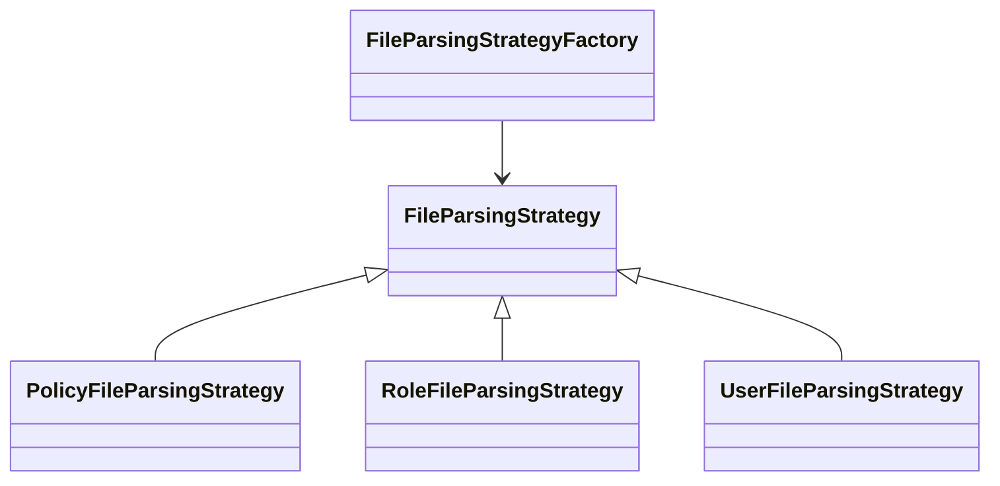
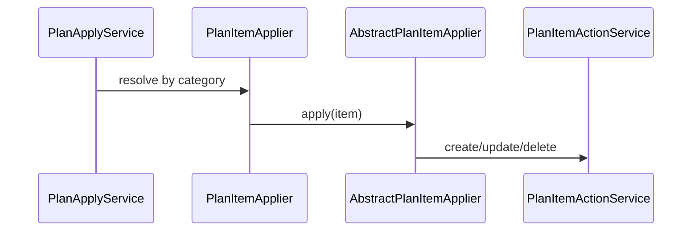

# Design Patterns in CaC-IAM

The IAM adaptor reuses a handful of patterns from CaC-Ex to keep plan/apply behavior predictable and easy to extend.

## Strategy + Factory (Parsing)
- `FileParsingStrategy` implementations (`Policy/Role/UserFileParsingStrategy`) encapsulate directory detection, JSON deserialization, and key derivation.  
- `FileParsingStrategyFactory` discovers strategies and routes each `Path` to the first one whose `supports` method returns true, or by category lookup.

## Template Method (Apply)
- `AbstractPlanItemApplier` enforces payload type checking and switches on `Action`, delegating CRUD operations to a `PlanItemActionService`.  
- Concrete appliers (`PolicyPlanItemApplier`, etc.) simply wire the right payload class and API service.

## Adapter (Persistence)
- `StateRepository` abstracts persistence; `CosmosStateRepository` adapts Azure Cosmos APIs to the repository contract and handles partition keys, query specs, and type conversion.

## Rule Engine (Ordering)
- `PlanOrderingRuleEngine` converts property-based rules (`plan.ordering.rules[*]`) into ordered groups so category/action sequencing can change without code edits. A stable tie-breaker preserves discovery order.

## Reporting Template
- `MasterPlanHtmlReportGenerator` loads a static template, injects serialized plan JSON, and writes `plan/masterplan.html`. The template isolates UI changes from plan generation code.

Keep this document current when introducing new categories, integrations, or ordering behaviors so future contributors can plug into the existing patterns instead of reinventing them.
